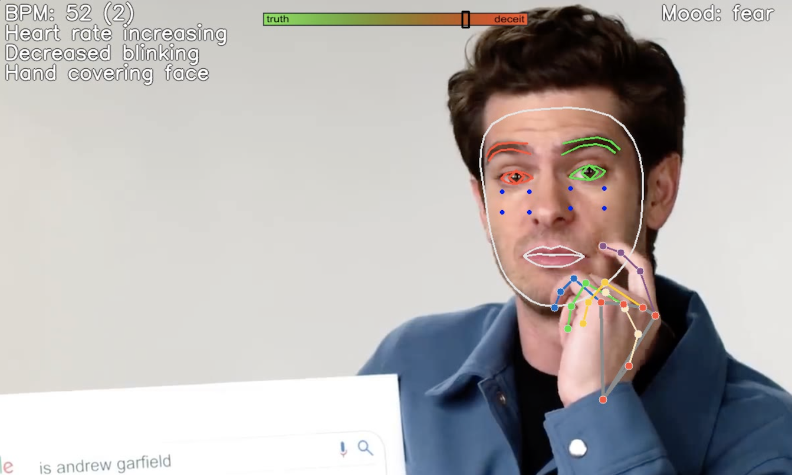

# Truthsayer (Veraz)

Remote, camera-based **cue dashboard** for interviews and recordings: heart rate from the face, blink and gaze change, lip and hand adapters, Eulerian motion magnification, facial-motion VRMS, optional voice pitch / RMS, utterance windows, and a 60 s dual talking calibration.

It is built to *surface* signals that deception-research papers actually measure. It is **not** a lie detector. Cue-load is an arousal/concordance index. See [docs/SCIENCE.md](docs/SCIENCE.md). Docs index: **[docs/README.md](docs/README.md)**. Public site: **[edwinkestler.github.io/Truthsayer](https://edwinkestler.github.io/Truthsayer/)**.



Video walkthrough of the original prototype: [YouTube](https://youtu.be/5q-BQ2Q_pqI).

## What it measures

| Modality | Method | In the UI |
|---|---|---|
| Visual facial BPM | POS rPPG on both cheeks (Wang 2017) | BPM, SNR, pulse waveform |
| Motion augmentation | Eulerian bandpass on the face crop (Wu 2012) | `motion x18` panel |
| VRMS | RMS of Face Mesh landmark velocity | VRMS value + burst tell |
| Voice | Autocorrelation F0, RMS dB, spectral peak | `--voice` |
| Classic tells | Blink rate, gaze shift, lip compression, hand-on-face, FER mood | Left-side labels |
| Fusion | Weighted cue load (pulse and gaze weighted highest) | Top bar + meter marker |
| Utterance window | Cue stats over a voiced statement | `utterance 4.2s \| ΔBPM …` |
| Dual talking calibration | 30 s factual answers + 30 s instructed false answers, then freeze | `CAL TRUE` / `CAL LIE`, then `vs truth-talk z=` |
| ReAct agent | Operational actions only (`continue` / `flag_review` / `need_more_data`) | Review flag; never “lying” |

Details, citations, and failure modes: **[docs/SCIENCE.md](docs/SCIENCE.md)**.  
Module map: **[docs/ARCHITECTURE.md](docs/ARCHITECTURE.md)**.  
CLI cookbook: **[docs/USAGE.md](docs/USAGE.md)**.  
Architecture reference (rUv Liar-Ai gist): **[docs/references/LIAR_AI.md](docs/references/LIAR_AI.md)**.  
GLD statement windows / why we skip their face CNN: **[docs/references/GLD_2104.12345.md](docs/references/GLD_2104.12345.md)**.

## Quick start (GPU `.venv`)

Python **3.9** + TensorFlow **2.10** + CUDA **11.2** / cuDNN **8.1**, all inside `.venv`. One-time setup:

```powershell
cd E:\Truthsayer
& .\.conda\python.exe scripts\setup_gpu_venv.py
.\.venv\Scripts\Activate.ps1
python intercept.py --input 0 --landmarks 1 --flip 1
```

Press `Q` in the preview to quit. Confirm the GPU:

```powershell
python -c "import tensorflow as tf; print(tf.config.list_physical_devices('GPU'))"
```

Typical interview run (mic + calibration + log):

```powershell
python intercept.py --input 0 --landmarks 1 --flip 1 --voice --log
```

First ~30 s: answer general-knowledge **truthfully**. Next ~30 s: **invent false answers**. Then templates freeze. `N` skips a phase, Enter advances, `Q` quits.

Full GPU notes: **[docs/GPU.md](docs/GPU.md)**.

## Setup from scratch (CPU conda, optional)

```powershell
conda create --name truthsayer python=3.9
conda activate truthsayer
python -m pip install "tensorflow<2.11"
python -m pip install -r requirements.txt
```

CPU TensorFlow works without CUDA; you will see `cudart64_110.dll` warnings.

## Requirements

- GPU venv: `requirements-gpu.txt` (MediaPipe 0.10.9, TF 2.10, NumPy 1.23.5, protobuf 3.20.3).
- Legacy CPU pins: `requirements.txt`.

## Tests

```powershell
.\.venv\Scripts\python.exe run_smoke_tests.py
```

## GitHub Pages

The micro site is static HTML in [`docs/`](docs/) (`index.html`, `404.html`, `assets/`). Markdown under `docs/` is for the repo, not Jekyll.

After the first push, enable Pages once:

1. Repo **Settings → Pages**.
2. Source: **GitHub Actions** (workflow [`.github/workflows/pages.yml`](.github/workflows/pages.yml)).
3. Fallback if Actions is unavailable: **Deploy from a branch** → `master` → `/docs`.

Site URL: https://edwinkestler.github.io/Truthsayer/

## Responsible use

Do not treat the meter, “tells,” or cue-load bar as proof of deception. Independent work (DDPM 2021, DePaulo 2003, Harnsberger 2009) shows small effects, high false-positive risk, and chance-level commercial voice-stress tools. Use this software for research, training, and exploratory analysis only.
